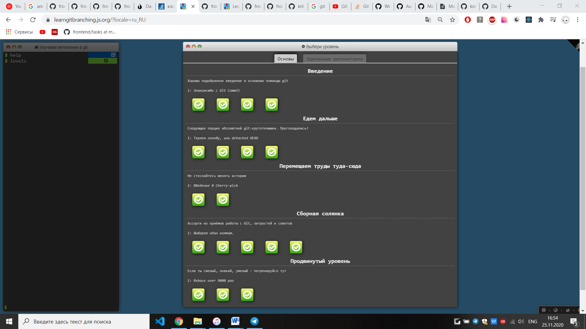
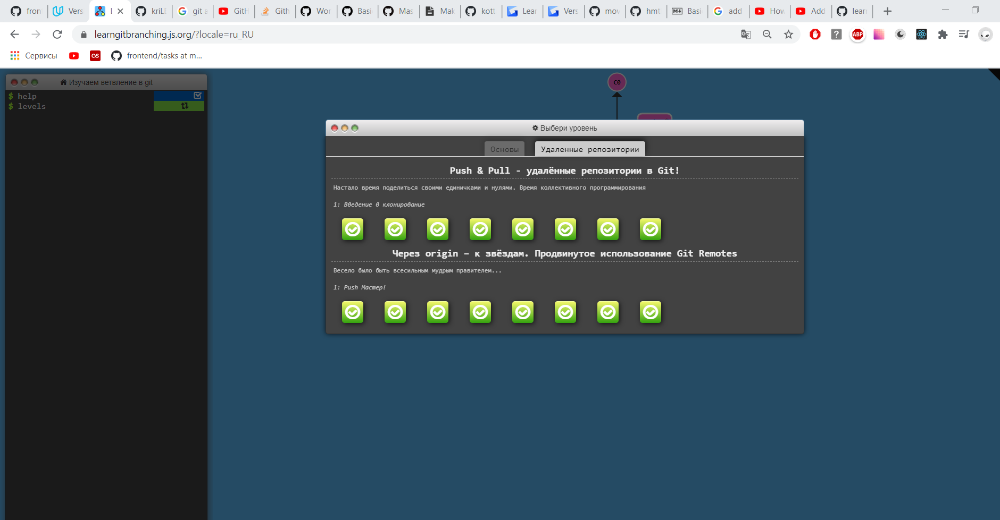

# Git Basics

1.	 [Version control with Git](https://www.udacity.com/course/version-control-with-git--ud123) course

I`ve already known a basic git, but it was very nice to repeat some things.


2.	Complete [learngitbranching.js.org](https://learngitbranching.js.org/)
Wow! It was interesting and sometimes not easy! Firstly I used git commands, like ``` git rebase ``` or ``` het cherry-pick ```. So, I improved my skills, thank you for this challenge.


