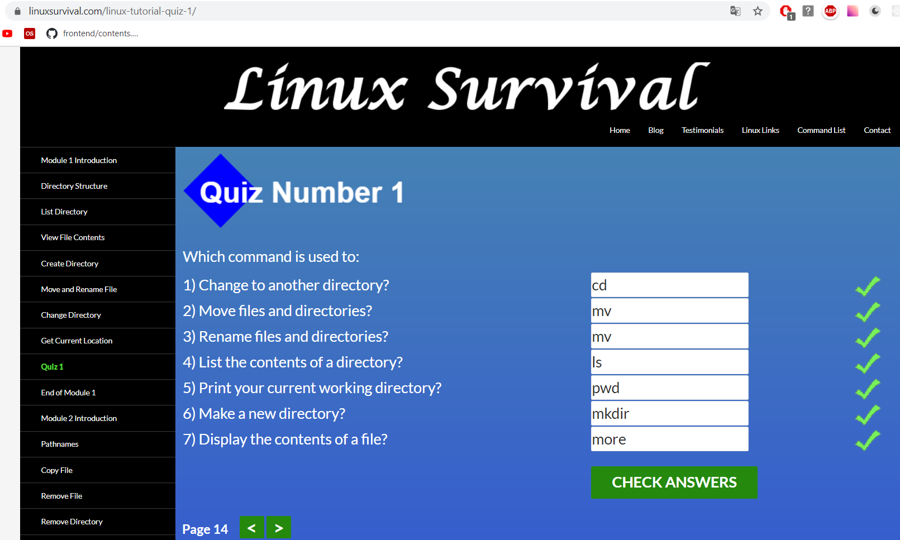
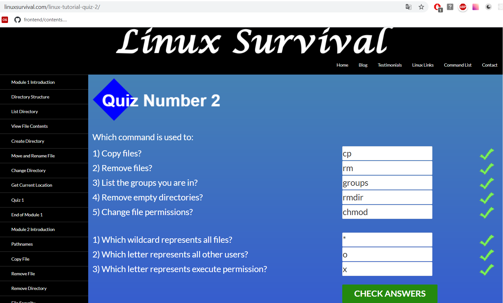
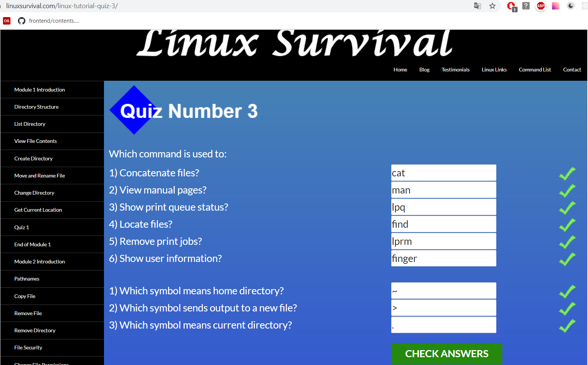
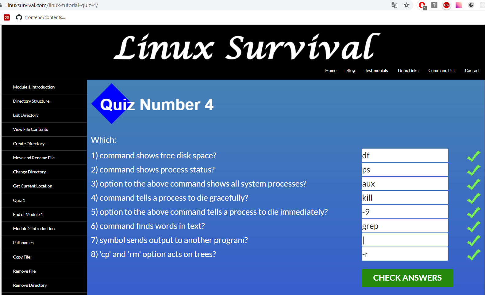

# Linux CLI and HTTP

### Linux CLI

Before today i was a little bit familiar with Linux, I`ve known commands only from first module (work with directories). Other modules are new for me, and now I know more about Linux CLI

Linux survival screenshots:

### HTTP

My speciality in university is "Telecommunication networks", so it was a good idea to remember things which I studied in university.

It was useful to me read about headers and request format, about request-related API in Express.js

Second part article "HTTP: The Protocol Every Web Developer Must Know" is more detailed and  helpful for me and I really happy that I read it. Some information about Identification and Cashing is new for me.