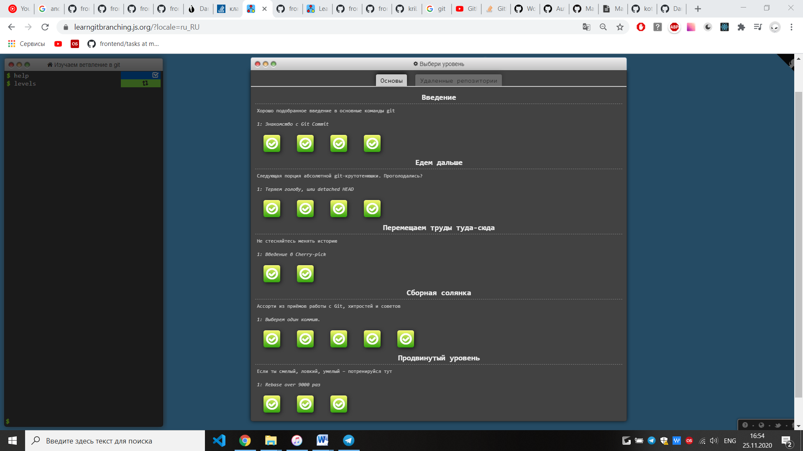

# Kottans-frontend
 Stage 0 for kottans front-end course


## Git intro

1.	 [Version control with Git](https://www.udacity.com/course/version-control-with-git--ud123) course

I already known a basic git, but it was very nice to repeat some things.

<details>
<summary>Screenshot</summary>
  
  
  
</details>

2.	Complete [learngitbranching.js.org](https://learngitbranching.js.org/)
Wow! It was interesting and sometimes not easy! Firstly I used git commands, like ``` git rebase ``` or ``` het cherry-pick ```. So, I improved my skills, thank you for this challenge.

<details>
<summary>Screenshot</summary>
  
  
  
</details>

<details>
<summary>Screenshot</summary>
  
  
  
</details>


## Linux CLI and HTTP

I did all level in [Linux Survival](https://linuxsurvival.com/linux-tutorial-quiz-4/) and read two articles about HTTP.

Before today i was a little bit familiar with Linux, I known commands only from first module (work with directories). Other modules are new for me, and now I know more about Linux CLI

Linux survival screenshots:

<details>
<summary>Screenshot 1</summary>
 
  
  
</details>

<details>
<summary>Screenshot 2</summary>
 
  
  
</details>

<details>
<summary>Screenshot 3</summary>
 
  
  
</details>

<details>
<summary>Screenshot 4</summary>
 
  
  
</details>

### HTTP

My speciality in university is "Telecommunication networks", so it was a good idea to remember things which I studied in university.

It was useful to me read about headers and request format, about request-related API in Express.js

Second part article "HTTP: The Protocol Every Web Developer Must Know" is more detailed and  helpful for me and I really happy that I read it. Some information about Identification and Caching is new for me.


## Git Collaboration

### Github & Collaboration

[Github & Collaboration](https://classroom.udacity.com/courses/ud456) course.

I have already known something about github collaboration, I made pull requests and pushed code before, but now I know more! Great!

<details>
<summary>Screenshot</summary>
 
 
 
</details>

### What was new
* Now I know a lot things about **forking** and have practice experience
* Also it useful to be familiar with ``` git rebase ```
* After this lesson I will not lost in github interface. I know about **fork**, **star**, **issues** and **CONTRIBUTING.md** file

I think, everything from this lesson I will use in the future.


### Learn Git Branching

<details>
<summary>Screenshot</summary>
 


</details>

<details>
<summary>Screenshot</summary>
 


</details>

